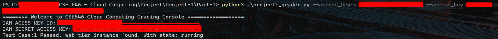
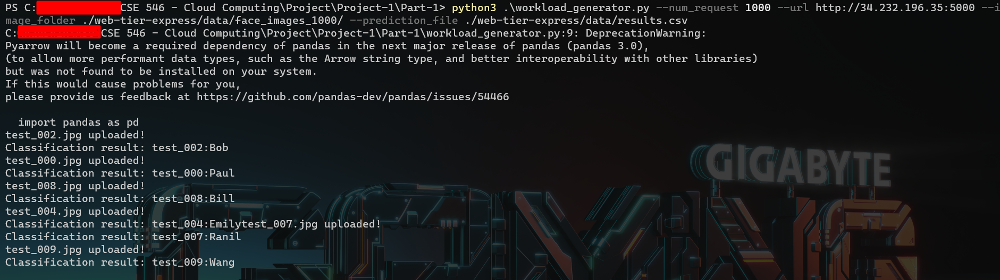
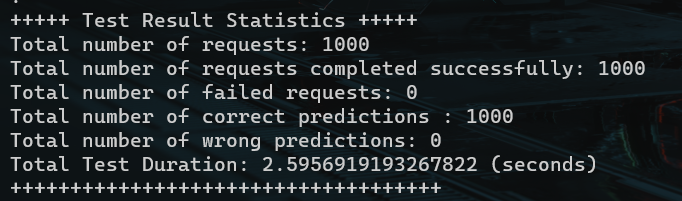

# Part-1: Starting out - EC2 instance, EIP, web tier (lookup)

- `instance_info.py` describes the instances on the *us-east-1* region
- `run_instances.py` launches one new instance, and associates the EIP 34.232.196.35 with it
- The `instance_run` script is passed as user-data to the launched instance, to be executed upon first boot

## Testing screenshots

- grader script

- workload generator test

